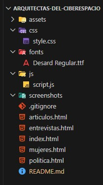

# Arquitectas del ciberespacio

Proyecto Web para CIFO La Violeta como ejercicio de maquetación avanzada utilizando HTML, CSS moderno y JS básico.

## Análisis

**Objetivo**
El objetivo del proyecto es dar visibilidad a la importancia de las mujeres en la tecnología, además de ser un espacio de reconocimiento, memoria e inspiración en el marco de las conmemoraciones del 08/Mar por el "Día del la mujer".

**Público objetivo (target)**
Público en general

**Análisis de la competencia**
Webs similares: 
https://websummit.com/
https://www.womentech.net/
https://mujerestech.org/
https://www.mujeresentech.org/

**Propuesta de valor**
Ofrecemos un lugar de referencia e inspiración para 
nuestra generación y las que nos preceden. Damos altavoz y creamos un espacio donde la mujer es el centro, apostamos por la visibilización de los logros y las dificultades muchas veces ignoradas.

Trabajamos con paleta de azules, grises y acentos vibrantes que conectan con el universo digital, la innovación y la visibilidad, sin perder calidez ni fuerza. La estética busca transmitir que esta no es una web “sobre mujeres” en un sentido superficial, sino una plataforma con criterio, con mirada editorial y con autoridad dentro del ámbito tech.
También elegimos tipografías modernas, limpias y contundentes, que refuerzan esa idea de credibilidad, actualidad y diseño digital. Todo el sistema visual está pensado para sostener cuatro valores clave que queríamos comunicar desde el primer vistazo: autoridad y credibilidad tech, empoderamiento, modernidad e inclusión. En conjunto, la web no solo informa, sino que construye una presencia de marca clara: una voz valiente, inteligente e inspiradora que pone en el centro a las mujeres que están haciendo historia en tecnología.

**Contenido y estructura**
_index.html_: Página principal. Declaración de intenciones. Presentación de las mujeres más representativas. Enlaces a los artículos relacionados.
_articulos.html_: Artículos sobre temas aún pendientes para el reconocimiento de la importancia de la mujer en es aspecto tecnológico.
_entrevistas.html_: Sección de entrevistas a mujeres destacadas del ámbito. 
Página dedicada al formato podcast/entrevista. Incluye: cabecera visual con imagen destacada, manifiesto del proyecto, bloque principal de entrevista destacada con reproductor de audio, transcripción en formato pregunta/respuesta, sección de frases destacadas visuales, bloque de próximas entrevistas.

_mujeres.html_: Timeline con hitos de sus aportes y galería flip-card sobre aportes mas destacados.
_politica.html_: Información legal general sobre la aplicación del reglamento general de protección de datos y la cesión de derechos de imagen y voz.

**Aspectos técnicos básicos**

- Usamos Figma, HTML5, CSS3 y JS; además nos apoyamos del versionamiento y acceso al repositorio compartido del git y github. Como herramienta de desarrollo, usamos el IDE de Visual Studio Code.

## 📌 Descripción

**"Arquitectas del Ciberespacio"** Es una web responsive, usando HTML, CSS y JS, sin el apoyo de frameworks y CMS.

_HTML_:

- Todos los elementos requeridos para la estructura de una web actual

_CSS_:

- Layout con Grid y Flexbox
- Tipografía fluida con clamp()
- Transiciones y transformaciones
- Scroll Snap
- Estados interactivos (hover, focus)
- Enfoque Mobile First

_JS_:

- Captura de elementos con document.querySelector() y document.querySelectorAll()
- Método classList.toggle() para añadir/quitar clases CSS que determinaban visiblidad de los elementos HTML
- Métodos AddEventListener() para "escuchar" eventos "click" generados por los usuarios.

---

## 🎯 Objetivos técnicos del proyecto

- Construir una web completamente responsive.
- Aplicar buenas prácticas de estructura HTML semántica.
- Utilizar CSS moderno para crear layouts complejos.
- Implementar microinteracciones visuales con JS.
- Crear y mantener un código limpio y organizado.

---

## 🛠 Tecnologías utilizadas

- Figma Software online (mockups de la web)
- HTML5
- CSS3
  - Variables de CSS (tamaños de font y colores -modo claro y oscuro-)
  - Flexbox
  - CSS Grid
  - clamp()
  - Scroll Snap
  - Transiciones
  - Transformaciones
- JS
- Github/Git
- Github link: [arquitectas-del-ciberespacio](https://github.com/NzingaMbande/arquitectas-del-ciberespacio)

---

## 📂 Estructura del proyecto

La organización de la estructura del proyecto intenta separar por componentes los recursos utilizados; teniendo en la **raiz** del proyecto los .html que corresponden a cada página de la web, los **assets** que contienen las imágenes que se muestran, la carpeta **css** para el archivo de los estilos, la carpera **fonts** para la tipografía, **js** para el script de javascript propio del proyecto, y la carpeta **screenshot** para las imágenes requeridas para la documentación.

## 📱 Responsive Design

El proyecto está desarrollado con enfoque **Mobile First**

Breakpoints utilizados:

- Mobile: por defecto.
- Tablet: min-width: 768px
- Desktop: min-width: 1024px

Se han utilizado unidades relativas (`rem`, `%`, `vw`) y tipografía fluida mediante `clamp()` para garantizar escalabilidad.

---

## 🎨 Decisiones técnicas relevantes

- Por qué se eligió Grid para el layout principal:
  Para establecer una estructura general aplicable a cada página web que compone el proyecto.
- En qué partes se utilizó Flexbox y por qué.
  Se utilizó para los componentes que contengan elementos, a fin que puedan distribuirse y ordenarse según el diseño acordado.
- Cómo se gestionaron las transformaciones y transiciones: mayoritariamente con pseudo elementos CSS
- Cómo se abordó la accesibilidad básica (si lo han hecho): uso de Alt en imágenes.

---

## ⚠️ Retos encontrados

- Buscar contenido que no se quede en informar; si no que aporte para la visibilización y reconocimiento de la importancia de la mujer en la tecnología.
- Conocimientos básicos de JS para manejar eventos y lograr dinamismo en la web.

**Qué problemas surgieron.**

- Dominio del Git y Github
- Falta de tiempo
- Entendimiento y coordinación grupal
- Dirigir y repartir el trabajo equitativamente

**Qué soluciones se aplicaron.**

_Sobre git y github_: Tecnologías difíciles de dominar para estudiantes noveles, pero imprenscindibles por las caracteristicas del proyecto. Asesoría con el profesor del curso y apoyo grupal.

_Sobre falta de tiempo_: Sobre todo porque durante algunos días las clases no se detuvieron y el tiempo para avanzar y coordinar se vió afectado. Cada miembro intentó aprovechar las franjas de clase destinadas al avance del proyecto. Aparte, se tuvo que dedicar tiempo personal fuera de los horarios de estudio.

_Entendimiento y coordinación grupal_: Inicialmente, fue difícil lograr el entendimiento entre los miembros del grupo. Cada uno quería aportar con sus ideas y/o experiencias, por lo que más de una vez fue necesario una intervención de la Project Manager (Mary Ramos) y del profesor (Manel Plaza) para lograr consensos.

**Qué se aprendió técnicamente.**

Un aporte básico de JS puede lograr efectos que hacen más vistosa la web. Las herramientas que HTML5 y CSS3 ofrecen están en constante evolución y es fácil encontrar nuevas formas de mostrar una página html.

## 🚀 Mejoras futuras

- Integración con backend para implementar suscripciones
- Buscar a futuro hacer un proyecto con mayor visibilidad y evolutivo.
- Aprender a subir un proyecto web al internet, desde las opciones gratuitas hasta las más profesionales.
- Mejora de accesibilidad.
- Añadir un botón de compartir.

---

## 👨‍💻 Autor

[arquitectas-del-ciberespacio](https://github.com/NzingaMbande/arquitectas-del-ciberespacio)

Nombre de los alumnos:

- Mary Ramos (Project Manager)
- Rocio Goyoneche
- Antón Koval
- Arnau Pardal
- Franco Calderón

Profesor del Curso:
Manel Plaza

Curso:
Confección y Publicación Web Año: 2026

---

## Capturas de pantalla.

[capturas de pantalla de la web]???
